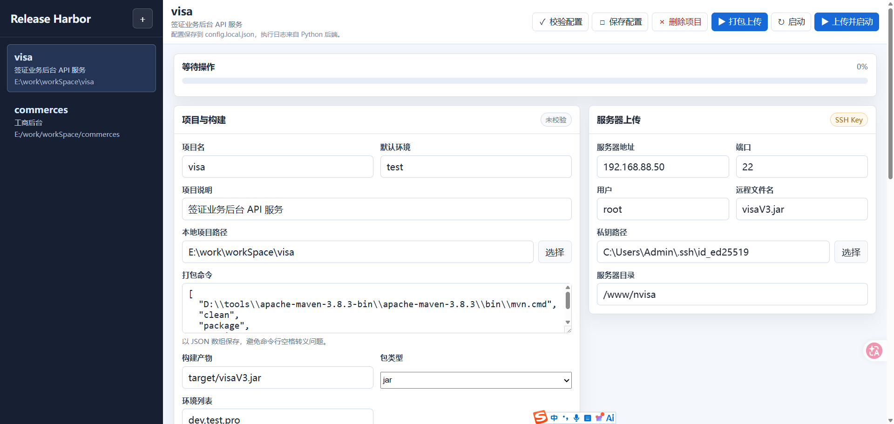
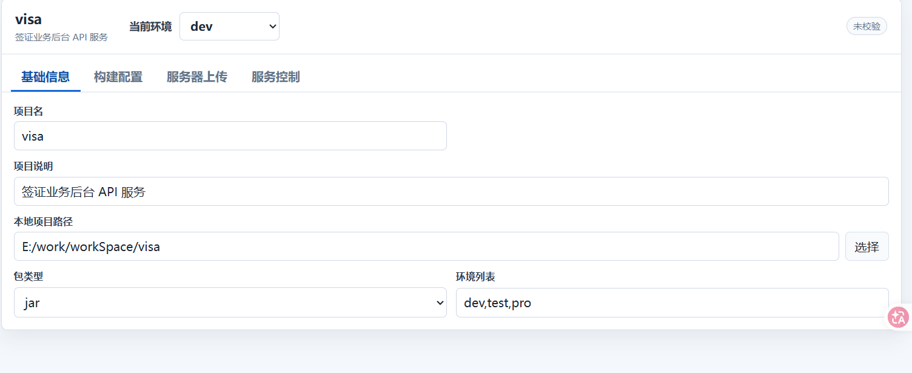
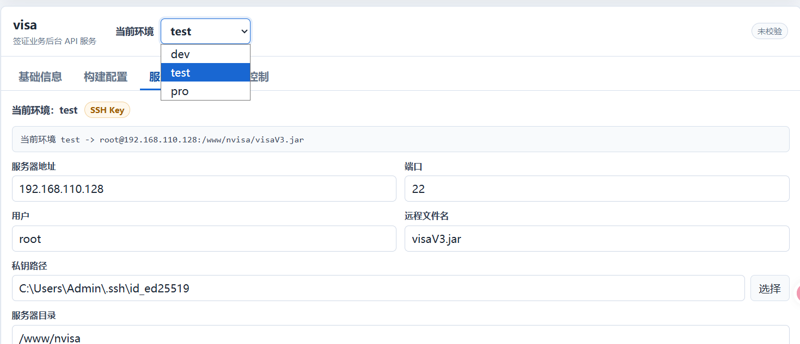
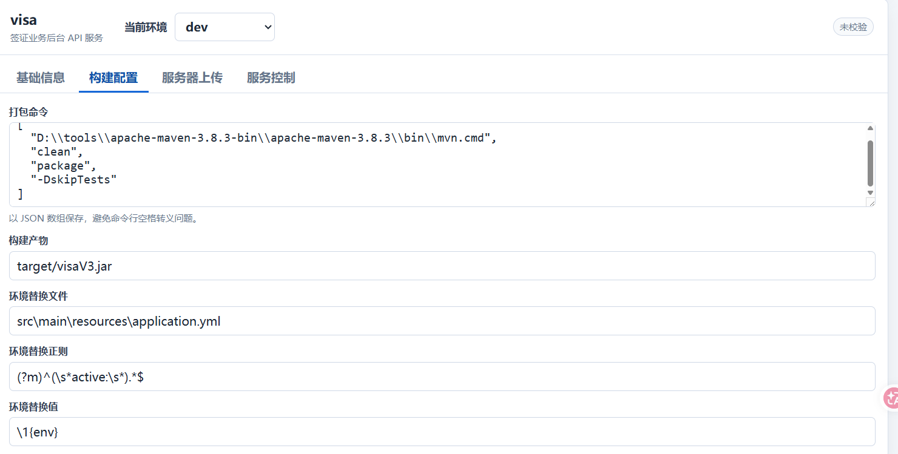
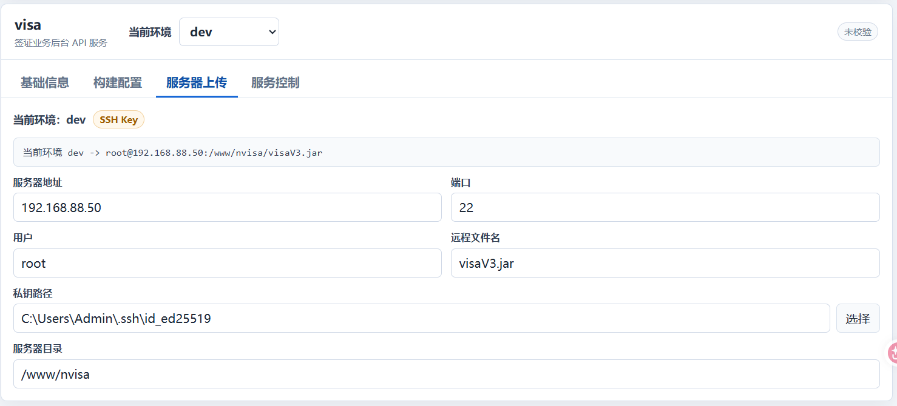
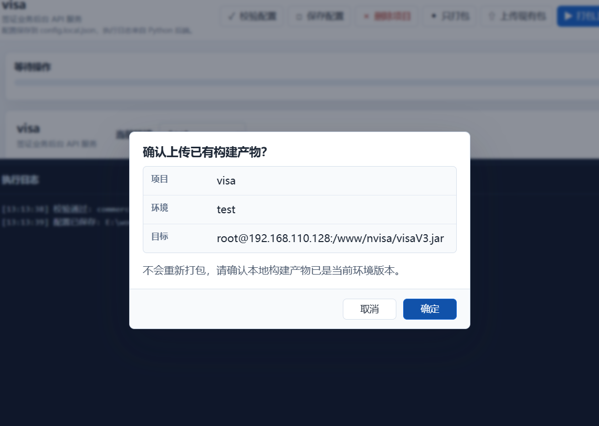
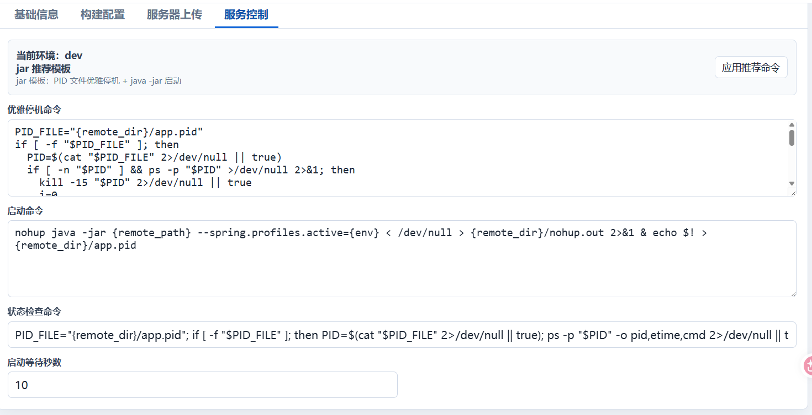
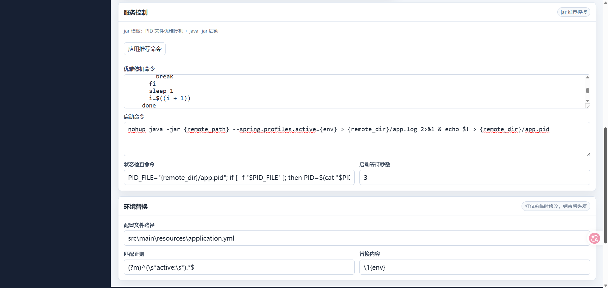
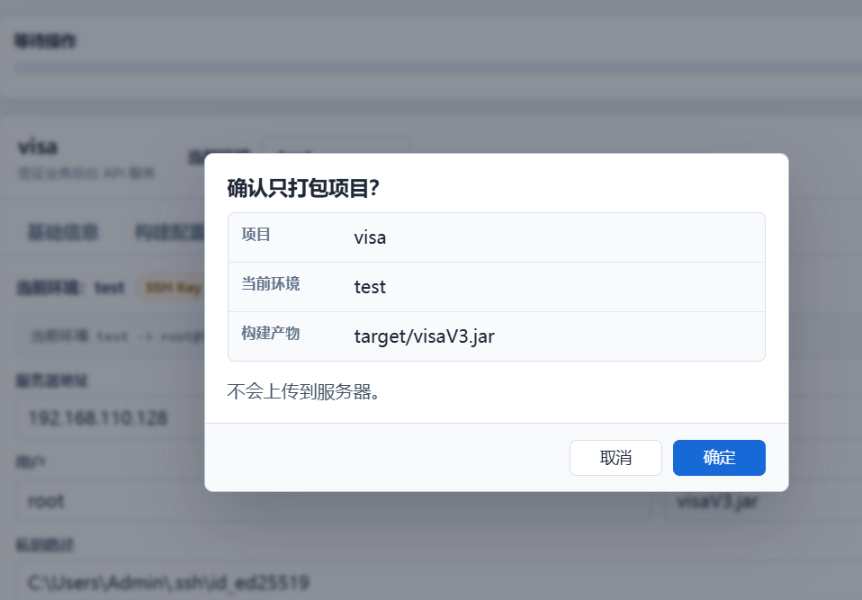
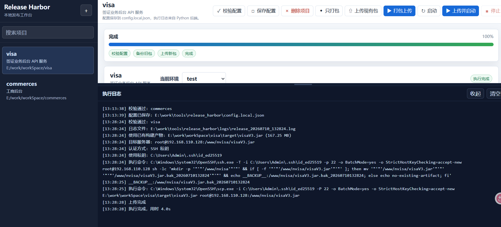

# Release Harbor 发布港

本地 H5 发布工作台：打包、上传、启停一站完成。

Release Harbor 发布港是一个本地 H5 发布工作台，用于通过页面配置项目发布流程，并由 Python 后端执行真实操作：切换环境配置、执行 Maven 打包、备份服务器旧包、上传新 jar，并通过 PID 文件方式停止和启动服务。

## 界面预览

系统总览一屏展示项目列表、操作区、配置区和日志入口，常用发布动作都集中在工作台中。

基础配置用于维护项目路径、构建命令、构建产物路径和包类型等核心字段。



环境配置用于维护 dev、test、pro 等环境列表，以及打包前后的环境文件替换规则。






配置校验用于检查本地路径、构建命令、SSH 配置和服务命令等关键项是否可用。



打包上传流程用于重新构建后上传产物，适合需要确保本地包与当前环境一致的发布场景。



服务启停用于维护远程停止、启动和状态检查命令。



服务命令模板、环境替换和发布控制区域分开展示，细节配置也能看得很清楚。



只打包流程用于在本地切换环境并执行构建，不上传到远程服务器。



执行进度与日志用于查看发布步骤状态、实时输出和失败原因。



当前推荐入口是本地 Web 页面：

```text
http://127.0.0.1:8765/
```

服务默认只监听 `127.0.0.1`，只给本机浏览器使用，不对局域网开放。

## 目录说明

### 必需保留

- `release_harbor.py`：核心打包、上传、远程启停逻辑，`web_server.py` 会引用其中的函数。
- `web_server.py`：本地 HTTP 后端，负责提供 H5 页面和 API 接口。
- `frontend/`：Vue 3 + Vite 前端源码，修改页面时优先改这里。
- `web/`：Vue 构建后的静态页面，`web_server.py` 会直接托管这个目录。
- `config.example.json`：可迁移的配置模板。
- `config.secret.example.json`：账号密码模式的敏感配置模板。
- `.gitignore`：忽略本机配置、日志和缓存。
- `README.md`：项目说明和操作文档。

### 本机生成或不建议迁移

- `__pycache__/`、`*.pyc`：Python 缓存，可删除，会自动生成。
- `logs/`：运行日志目录，可保留用于排查问题，但不是工具运行必需文件。
- `config.local.json`：本机真实项目、服务器和密钥路径配置，不建议提交。迁移时可以参考复制，但必须重新检查路径。
- `config.secret.json`：本机敏感配置，不迁移、不提交。

### 当前不建议删除

`release_harbor.py` 里仍保留了早期 Tkinter 桌面入口。虽然现在主交互方式是 H5 页面，但 Web 后端仍复用其中的核心发布函数，所以先保留。

## 环境要求

迁移到其他电脑可以运行，但目标电脑需要准备：

- Python 3。
- JDK 和 Maven。
- Windows OpenSSH，通常使用 `C:\Windows\System32\OpenSSH\ssh.exe` 和 `scp.exe`。
- 能访问项目源码目录，例如 `E:\work\workSpace\visa`。
- 能登录目标服务器的 SSH 密钥，或可选的账号密码配置。
- 如果使用 SSH key，公钥需要提前加入服务器用户的 `~/.ssh/authorized_keys`。

本工具目前只使用 Python 标准库，不需要额外安装 Flask、Django 等 Python 依赖。

## 快速开始

1. 进入工具目录：

   ```powershell
   cd E:\work\tools\release_harbor
   ```

2. 如首次使用，复制配置模板：

   ```powershell
   Copy-Item .\config.example.json .\config.local.json
   ```

3. 启动本地 Web 后端：

   ```powershell
   python E:\work\tools\release_harbor\web_server.py --open-browser
   ```

   也可以直接双击工具目录下的 `start_release_harbor.bat`。如果后端已经在运行，脚本会直接打开已有页面。

4. 浏览器打开：

   ```text
   http://127.0.0.1:8765/
   ```

5. 在页面中配置或检查：

   - 项目名。
   - 本地项目路径，可点击右侧 `选择` 按钮打开文件夹选择框。
   - 打包命令。
   - 构建产物路径。
   - 环境列表和默认环境。
   - 服务器地址、用户、远程目录、远程文件名。
   - 私钥路径，可点击右侧 `选择` 按钮打开文件选择框。
   - 服务停机、启动、状态检查命令。

6. 常用按钮：

   - `校验配置`：检查本地路径、构建命令、SSH 配置等是否可用。
   - `保存配置`：写入 `config.local.json`。
   - `只打包`：切换环境、Maven 打包、检查构建产物，不上传服务器。
   - `上传现有包`：不重新打包，直接备份服务器旧包并上传当前构建产物。
   - `打包上传`：切换环境、Maven 打包、备份旧包、上传新包。
   - `启动`：只执行远程停机、启动、等待和状态检查。
   - `上传并启动`：完整执行打包、上传、停机、启动流程。

## 前端开发

页面源码在 `frontend/`，使用 Vue 3 + Vite。Python 后端仍然托管 `web/` 目录，前端构建后会输出到 `web/`。

首次开发前安装依赖：

```powershell
cd E:\work\tools\release_harbor\frontend
pnpm install
```

开发调试：

```powershell
pnpm run dev
```

生产构建：

```powershell
pnpm run build
```

构建成功后，重新启动 `web_server.py` 或刷新 `http://127.0.0.1:8765/` 即可看到新页面。

## 配置说明

### 项目配置

`projects` 中每个项目代表一个可发布项目，常用字段如下：

- `name`：项目名，页面左侧列表展示用。
- `description`：项目说明，用于描述项目用途，例如“签证业务后台 API 服务”。
- `path`：本地项目路径。
- `build_command`：打包命令数组，例如 Maven 命令。
- `package_type`：包类型，支持 `jar` 或 `war`。页面可根据包类型应用推荐服务命令模板。
- `artifact`：构建产物路径，可写相对项目目录的路径，例如 `target/visaV3.jar`。
- `environments`：可选环境列表。
- `default_environment`：默认环境。
- `environment_replacements`：打包前临时替换环境配置，打包后会恢复。

### 上传配置

`deploy` 用于配置远程服务器：

- `auth_type`：`key` 表示 SSH 私钥模式，`password` 表示账号密码模式。
- `host`：服务器地址。
- `port`：SSH 端口，默认 `22`。
- `user`：SSH 用户。
- `private_key`：私钥路径，仅 `key` 模式需要。
- `remote_dir`：服务器目标目录。
- `remote_filename`：上传后的真实文件名，例如 `visaV3.jar`。
- `ssh_path` / `scp_path`：Windows OpenSSH 命令路径。

### 环境专属配置

如果 `dev`、`test`、`pro` 对应不同服务器或目录，可以使用 `environment_configs` 为每个环境覆盖上传和服务配置。执行时会先读取项目默认 `deploy` / `service`，再叠加当前环境的覆盖字段。

```json
{
  "environment_configs": {
    "dev": {
      "deploy": {
        "host": "dev.server.host",
        "remote_dir": "/www/visa-dev"
      }
    },
    "test": {
      "deploy": {
        "host": "test.server.host",
        "remote_dir": "/www/visa-test"
      },
      "service": {
        "startup_wait_seconds": 5
      }
    }
  }
}
```

上面示例中，未写的字段会继承项目默认配置，例如 `user`、`private_key`、`remote_filename`。页面里的“服务器上传”和“服务控制”都可以选择正在编辑的环境。

### 环境多副本

如果同一个环境部署在多台机器上，可以在该环境下配置 `replicas`。每个副本可以独立覆盖 `deploy` 和 `service`；未写字段会继续继承项目默认配置和当前环境配置。

```json
{
  "environment_configs": {
    "pro": {
      "deploy": {
        "remote_dir": "/www/visa"
      },
      "replicas": [
        {
          "name": "pro-1",
          "deploy": {
            "host": "pro-1.server.host"
          },
          "service": {
            "start_command": "nohup java -jar {remote_path} --spring.profiles.active={env} > {remote_dir}/app-pro-1.log 2>&1 &"
          }
        },
        {
          "name": "pro-2",
          "deploy": {
            "host": "pro-2.server.host"
          },
          "service": {
            "start_command": "nohup java -jar {remote_path} --spring.profiles.active={env} > {remote_dir}/app-pro-2.log 2>&1 &",
            "startup_wait_seconds": 5
          }
        }
      ]
    }
  }
}
```

执行 `上传现有包`、`打包上传`、`启动`、`上传并启动` 时，确认弹窗会列出当前环境下的副本，默认全选，也可以只勾选其中一台做灰度。构建和环境替换只执行一次，上传和服务启停会按副本顺序逐台执行；每个副本会使用自己的服务命令，未配置的服务字段会从环境或项目配置继承。任一副本失败后任务会停止并在日志中标明失败副本。

### 服务命令占位符

服务停机、启动、状态检查命令支持以下占位符，执行前由后端替换：

- `{remote_dir}`：远程目录，例如 `/www/nvisa`。
- `{remote_filename}`：远程文件名，例如 `visaV3.jar`。
- `{remote_path}`：远程完整路径，例如 `/www/nvisa/visaV3.jar`。
- `{tomcat_home}`：Tomcat 根目录，例如 `/www/tomcat-commerces`。
- `{war_context}`：war 解压目录名，例如 `commerces.war` 对应 `commerces`。
- `{env}`：当前选择的环境。

当前默认启动命令会写入 PID 文件：

```sh
nohup java -jar {remote_path} --spring.profiles.active={env} < /dev/null > {remote_dir}/nohup.out 2>&1 & echo $! > {remote_dir}/app.pid
```

默认停机命令优先读取 `{remote_dir}/app.pid`，如果 PID 文件不存在或 PID 已失效，会按远程文件名查找进程；随后先发送 `kill -15`，最多等待 60 秒，仍未退出时再发送 `kill -9` 兜底。

如果项目是 `war`，页面可以切换为 Tomcat 推荐模板。典型配置例如：

```text
package_type = war
remote_dir = /www/tomcat-commerces/webapps
remote_filename = commerces.war
```

对应推荐启动命令：

```sh
rm -rf {remote_dir}/{war_context}
{tomcat_home}/bin/startup.sh
```

## 执行逻辑

`只打包` 流程：

1. 校验配置。
2. 按环境替换规则临时切换配置。
3. 执行 Maven 打包命令。
4. 检查构建产物是否存在。
5. 恢复本地环境配置。

`上传现有包` 流程：

1. 校验配置。
2. 检查构建产物是否存在。
3. 远程创建目标目录。
4. 如远程已有同名 jar，备份为 `xxx.jar.bak_yyyyMMddHHmmss`。
5. 通过 `scp` 上传新 jar。

`打包上传` 流程：

1. 校验配置。
2. 按环境替换规则临时切换配置。
3. 执行 Maven 打包命令。
4. 检查构建产物是否存在。
5. 远程创建目标目录。
6. 如远程已有同名 jar，备份为 `xxx.jar.bak_yyyyMMddHHmmss`。
7. 通过 `scp` 上传新 jar。
8. 恢复本地环境配置。

`启动` 流程：

1. 读取 PID 文件并优雅停机。
2. 执行启动命令。
3. 等待 `startup_wait_seconds` 秒。
4. 执行状态检查命令。

`上传并启动` 会串联以上两个流程。

## 配置校验

可以通过页面点击 `校验配置`，也可以命令行执行：

```powershell
python E:\work\tools\release_harbor\release_harbor.py --check-config
```

## 迁移到其他电脑

可以迁移。建议复制以下内容：

```text
release_harbor.py
web_server.py
web\index.html
web\app.js
start_release_harbor.bat
config.example.json
config.secret.example.json
.gitignore
README.md
```

不建议复制：

```text
__pycache__\
logs\
config.secret.json
```

`config.local.json` 可以作为参考复制，但迁移后必须检查：

- 本地项目路径是否存在。
- Maven 路径是否存在。
- JDK/Maven 是否可用。
- SSH 私钥路径是否存在。
- 服务器 `authorized_keys` 是否包含新电脑对应的公钥。
- `remote_dir` 和 `remote_filename` 是否符合目标服务器部署目录。

如果新电脑没有 SSH key，可以重新生成：

```powershell
ssh-keygen -t ed25519 -C "release_harbor"
```

然后把生成的 `.pub` 公钥内容加入服务器用户的 `~/.ssh/authorized_keys`。

## 多人共用同一项目

多个人、多台电脑可以同时配置同一个项目的 SSH key。每个人建议在自己的电脑上生成独立密钥，不要共用同一个私钥文件。

每个人本机生成密钥：

```powershell
ssh-keygen -t ed25519 -C "release_harbor_姓名或电脑名"
```

生成后，本机公钥通常在：

```text
C:\Users\你的用户名\.ssh\id_ed25519.pub
```

把 `.pub` 文件里的整行内容追加到服务器对应用户的 `~/.ssh/authorized_keys`。注意是追加，不是覆盖。

如果服务器上还没有 `.ssh` 目录或 `authorized_keys` 文件，可以先执行：

```sh
mkdir -p ~/.ssh
touch ~/.ssh/authorized_keys
chmod 700 ~/.ssh
chmod 600 ~/.ssh/authorized_keys
```

追加公钥时使用 `>>`：

```sh
echo 'ssh-ed25519 AAAA... release_harbor_zhangsan' >> ~/.ssh/authorized_keys
```

不要使用单个 `>`：

```sh
echo 'ssh-ed25519 AAAA... release_harbor_zhangsan' > ~/.ssh/authorized_keys
```

单个 `>` 会覆盖整个 `authorized_keys` 文件，可能导致其他人的公钥被清掉，从而影响其他人登录和发布。

推荐的多人管理方式：

- 每个人一把独立私钥，私钥只保存在自己电脑。
- 服务器 `authorized_keys` 里保留多行公钥，一人一行。
- 公钥注释里写清楚是谁或哪台电脑，例如 `release_harbor_lisi_pc`。
- 有人离职或电脑不再使用时，只删除对应那一行公钥。

SSH key 本身不会让多人互相冲突。但如果多人同时点击 `上传并启动` 同一个服务，发布动作可能互相覆盖或重复停启。实际使用时建议同一时间只由一个人发布同一个项目。

## 常见问题

### 页面打开 `localhost:8080` 不通

`localhost` 指当前电脑。如果在 Windows 浏览器打开 `http://localhost:8080/...`，访问的是 Windows 本机，不是远程 Linux 服务器。

本工具的页面地址是：

```text
http://127.0.0.1:8765/
```

### 修改 Python 后端代码后页面还是旧行为

需要重启后端：

```powershell
python E:\work\tools\release_harbor\web_server.py
```

如果旧进程还在运行，需要先停止旧的 Python 后端进程，再重新启动。

### 日志中出现 `mesg: ttyname failed`

这通常不是失败原因。重点看它后面的命令输出、退出码和 Python traceback。

### 退出码 `4294967295`

在 Windows OpenSSH 场景下通常表示远程 SSH 命令异常中断。常见原因包括远程命令杀掉了自己的 SSH 会话、认证失败、known_hosts 问题、远程 shell 命令语法错误等。需要结合日志中“执行命令”后面的输出判断。

## 安全说明

- 不要提交 `config.local.json` 和 `config.secret.json`。
- 不要在 README 或日志中写入服务器密码、私钥内容。
- 推荐使用 SSH key 登录服务器。
- 本地 Web 服务默认只监听 `127.0.0.1`。
